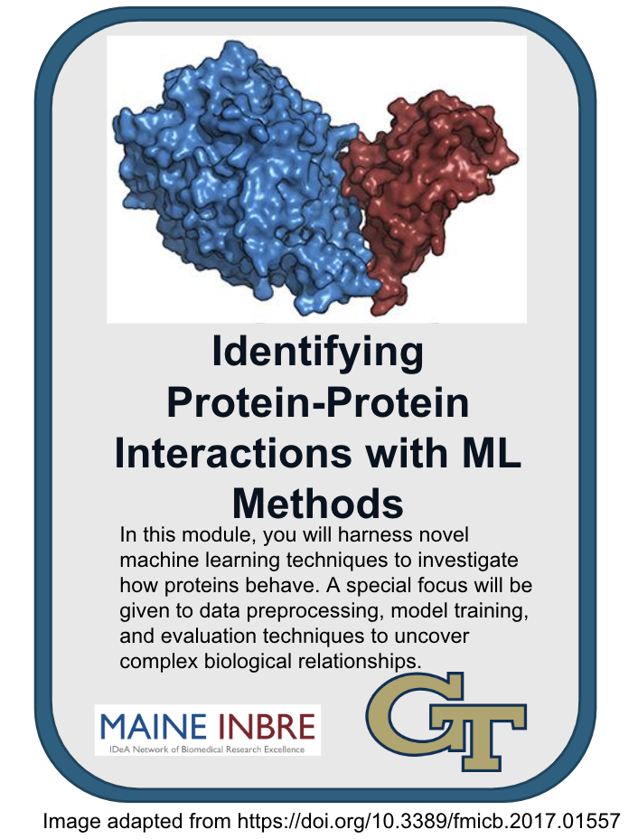
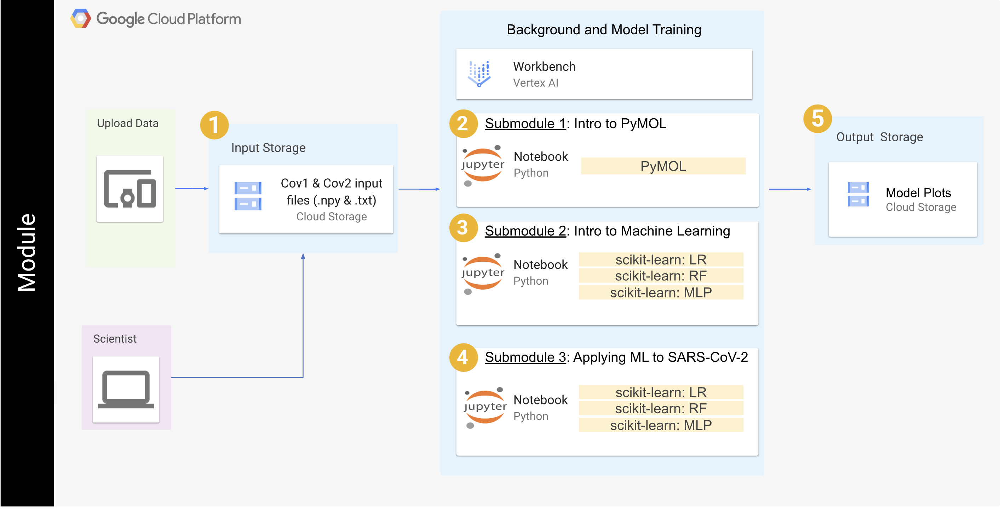

# Structural Biology and Drug Discovery

-------------

## **Contents**

- [Background](#background)
- [Overview](#overview)
- [Before Starting](#before-starting)
- [Getting Started](#getting-started)
- [Software Requirements](#software-requirements)
- [Architecture Design](#architecture-design)
- [Data](#data)
- [Funding](#funding)
- [License for Data](#license-for-data)

## **Background**
In this module, you wil learn how to apply machine learning (ML) methods to identify critical protein-protein interactions. This will allow you to distinguish the critical residues in making SARS-CoV-2 so much more infectious and lethal compared to SARS-CoV. 

The set of data that we have provided is molecular dynamics trajectories. Molecular dynamics (MD) is a type of biophysical simulation that looks how every atom in a particular biological system interacts with each other over a certain timescale. The output is known as a trajectory. It can be thought of as the "computational microscope into the cell." However, MD trajectories are a significant amount of data and can be difficult to analyze and parse through visually. 

This is where machine learning comes into play. We can take our MD trajectories and use that as an input for machine learning methods to analyze for us. In this particular situation, we have run MD on two distinct systems and would like to know the differences between them. More specifically, the two systems are SARS-CoV bound to the human receptor, hACE2, versus SARS-CoV-2 bound to hACE2. We would like to know exactly which residues on SARS-CoV-2 ended up driving the increased infectivity that led to the global pandemic we experiences in 2020. 


## **Overview**
In this tutorial, we will apply three different ML approaches - random forest, logistic regression, and multi-layer perceptron. We will analyze the residues at the interface of where SARS-CoV or SARS-CoV2 bind to hACE2. More specifically, the input data is the inverse of the distance between the residues. The tutorial is split into three separate modules. 

## **Module Design**

### Submodule 1 - Introduction To Pymol


### Submodule 2 - Introduction To Machine Learning

### Submodule 3 - Applying ML to SARS-CoV-2


<center></center><br><br>

## **Before Starting**
This module is designed to run on the Google Cloud Platform (GCP). Follow the instructions below to prepare to run the module on GCP.

#### Setting up GCP

This module is designed to run on the Google Cloud Platform (GCP).
Follow the instructions below to prepare to run the module on GCP.

<details>

<summary>Setting up GCP</summary>

See the [Vertex AI Quickstart instructions](https://cloud.google.com/vertex-ai/docs/workbench/instances/create-console-quickstart) for details on steps 1-5.

1. Create a Google Cloud account
2. Create a Google Cloud project
3. Enable billing for your Google Cloud project
4. Go to Vertex AI Workbench and create a new instance using "CREATE NEW" -> "ADVANCED OPTIONS" and use the following configurations:
   * Details:<br/>&emsp;Region: us-east4<br/>&emsp;Zone: us-east4-a<br/>&emsp;Workbench type:<br/>&emsp;&emsp;Type: Instance
   * Environment:<br/>&emsp;JupyterLab Version: JupyterLab 4.x
   * Machine type:<br/>&emsp;Series: e2<br/>&emsp;Machine type: e2-standard-8<br/>&emsp;Idle shutdown:<br/>&emsp;&emsp;Enable Idle Shutdown: Checked<br/>&emsp;&emsp;Time of inactivity before shutdown (Minutes): 60
   * Disks: Use default settings
   * Networking:<br/>&emsp;Assign external IP address: Checked<br/>&emsp;Allow proxy access: Checked
   * IAM and security<br/>&emsp;Security options:<br/>&emsp;&emsp;Root access to the instance: Checked<br/>&emsp;&emsp;File downloading: Checked<br/>&emsp;&emsp;Terminal access: Checked
   * System health: Use default settings
5. Click "OPEN JUPYTERLAB" on your instance to open JupyterLab
6. To clone the Github repository for this module in JupyterLab, open a Terminal (File -> New Launcher -> Terminal) and run the following commands:
```bash
cd ~
git clone https://github.com/rmagesh148/Structural-Biology-and-Drug-Discovery.git
```
<br>    
After the last command completes there should be a folder name *Structural-Biology-and-Drug-Discovery* that contains each submodule directory. Start with Submodule 0 to confirm you can spin up the PyMOL and AutoDock GUIs.    

</details>

## **Getting Started**
After you work through Submodule 0 please begin working through Submodules 1 - 3 in order. Each submodule notebook will consist of some background information and activities. For the activities, you will execute the code cells and/or work within the PyMOL/AutoDock VM's that you create based on the guidance provided in Submodule 0. Submodule 4 contains **OPTIONAL** activities relevant to the knowledge and skills provided through navigating Submodules 1-3 that can be completed for extra practice.

## **Software Requirements**
Access to PyMOL is provided through Submodule 0. All other required software is either downloaded through code execution within the notebook or, in limited situations, accessed through internal sites using the provided links.

## **Data**

## **Funding**
This resource was supported with funds from NIH grant P20 GM103424-21 

## **License for Data**
Text and materials are licensed under a Creative Commons CC-BY-NC-SA license. The license allows you to copy, remix and redistribute any of our publicly available materials, under the condition that you attribute the work (details in the license) and do not make profits from it. More information is available here.


